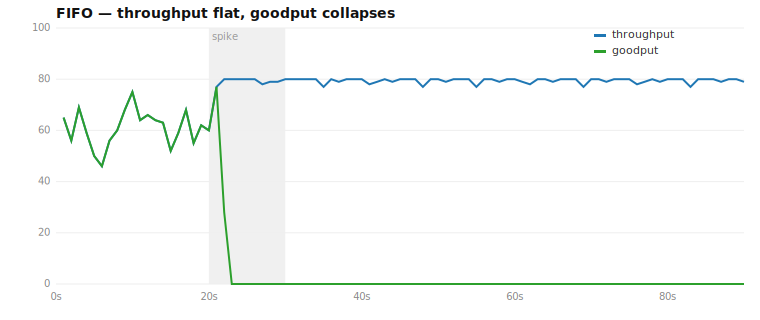
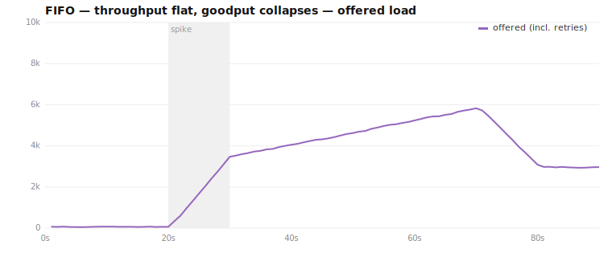
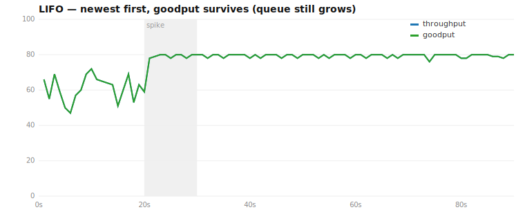
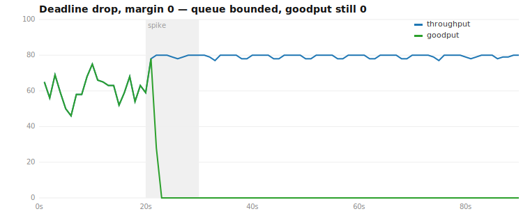
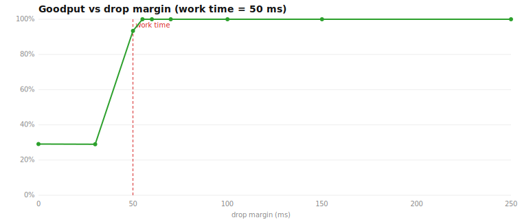
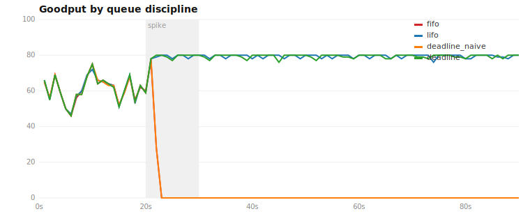

I built the `clients → API server → queue → backend` pipeline you've seen a
hundred times, pointed a ten-second load spike at it, and watched it spend the
next minute finishing a quarter-million requests that nobody was waiting for
anymore — with its throughput graph perfectly, reassuringly flat.

**TL;DR**: under overload a queue's *throughput* (work finished per second) can
hold rock-steady while its *goodput* (work finished while a client still wants the
answer) collapses to **zero** — and a client retry loop keeps it there long after
the spike is gone. The culprit is the queue discipline. Changing FIFO to *drop
work the backend can't finish in time* took goodput from **19% back to 100%** and
shrank the peak backlog **100×**, in about thirty lines of code.

<!--more-->

Here is the graph that should scare you:



The blue line is throughput — units of work the backend finishes per second. It
never moves. The same service, doing the same work, at the same rate, before and
after the spike. By every dashboard that tracks "requests completed," this system
is healthy.

The green line is *goodput* — units the backend finishes **while a client is
still waiting for the answer**. At the 20-second mark it falls off a cliff and
stays on the floor. The system is doing exactly as much work as before and almost
none of it matters.

This post is about how a perfectly adequate service folds under a load spike
without its throughput ever dropping, why it doesn't recover on its own, and
three increasingly correct ways to fix it.

**First, the honest disclaimer: every graph here comes out of a simulation.** Not
an abstract discrete-event model — it's a small Go program with real goroutines, a
real `time.Sleep` for the heavy work, and real client timeouts — but a model all
the same, and I chose its dynamics. The defaults: a backend of 4 workers at 50 ms
each (**80 ops/s** of hard capacity), a baseline of 60 ops/s (a comfortable 75%
utilisation), and a ten-second spike to five times capacity. Clients wait one
second, then give up and retry. That last choice is the one to poke at — *you
built a client that retries on timeout and then act surprised when the queue
collapses* — so let me defend it up front: real clients **do** retry (users mash
refresh, mobile apps reissue, upstream deadlines fire and re-request), and I
deliberately left out the things that would *soften* the collapse — backoff,
jitter, retry budgets — because those are better fixes and I want to come back to
them at the end. This is the pessimistic case on purpose. The headline numbers
(19%→100% goodput, a 100× smaller backlog) are artifacts of these particular
parameters and will move if you change them. What does **not** move is the
*relative* behaviour of the four queue disciplines under identical conditions —
that ordering is the whole point; the percentages are just how loud it gets at
these settings. Every parameter is a flag, so you can [reproduce](#reproduce-it)
this and turn the knobs yourself.

## Throughput is not goodput

Two definitions, because the whole post lives in the gap between them:

- **Throughput**: work completed per second. What your "ops/sec" dashboard shows.
- **Goodput**: *useful* work completed per second — work whose result someone is
  still there to receive.

Under normal conditions they're equal, which is exactly why we stop thinking
about the difference. The gap only opens under stress, and when it opens it opens
all the way.

## The system

A textbook asynchronous pipeline:

```
clients ──▶ API server ──▶ queue ──▶ backend
                │                        │
                └──────── store ◀────────┘
```

- **Clients** have two operations. `Start work` returns an operation handle.
  `Get operation` reports its status: pending, done, or failed.
- The **API server** keeps an in-memory store of operations. Each `Start`
  records a pending operation and drops one unit of work onto the queue.
- The **backend** pulls work off the queue, does something expensive (we model
  it as a sleep), and reports the operation done.

To keep the code readable I've collapsed the network hops into in-process
goroutines and a shared queue, but nothing about the dynamics depends on that —
the queue is the queue whether it's a channel or Kafka.

The backend's capacity is fixed and knowable: four workers, 50 ms per unit, so
**80 units/second**, full stop. I hold that 50 ms constant on purpose — a real
backend would get *slower* under this kind of load, not faster (cache pressure,
GC, context-switching, lock contention — the subject of my [last
post](/posts/shard-your-locks/)), but pinning service time keeps the variable of
interest isolated to the queue, and a degrading backend would only deepen the
collapse, not soften it. So that number never changes in anything that follows.
Every collapse you're about to see happens at constant throughput.

The one piece people skip — and it's the piece that matters — is what a client
does when it runs out of patience:

```go
func (c *Clients) user() {
	for attempt := 0; attempt < c.maxAttempts; attempt++ {
		now := time.Now()
		deadline := now.Add(c.timeout)
		id, work := c.store.Start(now, deadline)
		c.queue.Push(work)

		if c.waitForResult(id, deadline) {
			return // got it
		}
		// Timed out. The old operation is abandoned (still Pending in the
		// store, forever); loop around and issue a brand-new one.
	}
}
```

A timed-out client does not sit quietly and keep polling the same handle. It
**gives up and starts over** — a new `Start`, a new operation, a new unit of work
on the queue. This is what real clients do: the user mashes refresh, the mobile
app retries, the upstream service's deadline fires and it reissues. That single
behaviour is the difference between a queue that absorbs a spike and a queue that
amplifies it into a collapse.

And notice what's *not* in that loop: any delay between attempts. The client has a
`maxAttempts` cap but retries the instant its deadline fires — no backoff, no
jitter. That's deliberate, and it's the engine of everything that follows. Backoff
would space the retries out and starve the feedback loop, which is exactly why
it's on the fixes list at the end; leaving it out models the *naive* client
faithfully, and naive clients are precisely what make real retry storms vicious.

## Normal load: nothing to see

Baseline is 60 ops/second against 80 of capacity — 75% utilisation, a load you'd
be happy to run in production. Offered load, throughput, and goodput sit on top
of each other. The queue hovers near empty. Every client gets its answer well
inside the one-second patience window. This is the boring, correct state, and
it's worth internalising how boring it looks, because the failure mode gives no
warning from here.

## The spike

At t=20s, for ten seconds, offered load jumps to 400 ops/second — five times
capacity. Spikes like this are normal: a product launch, a retry storm from a
dependency, a cron job firing across a fleet, a celebrity tweet.

Ten seconds of overload is not, in itself, a catastrophe. 80 ops/s of capacity
should chew through a bounded backlog and recover. Watch what actually happens to
the offered load:



The spike was 400 ops/s for ten seconds. The offered load climbs past **3,000
ops/s** and stays elevated *long after the spike is over*. That extra load is
entirely manufactured by the system itself: every client whose deadline passes
abandons its operation and issues a fresh one. The queue fills, latency crosses
the one-second patience threshold, so more clients time out, so they retry, so
the queue fills faster. The spike lit the match; the retries are the fire.

## The collapse, and why it won't recover

With a plain **FIFO** queue, here's what the backend is doing. It always pulls
the *oldest* item first. Under a deep backlog the oldest item has been sitting
there for tens of seconds — its client gave up long ago. The backend spends a
full 50 ms of precious capacity computing an answer nobody will read, then picks
up the next-oldest corpse and does it again.

Fresh work — from clients who are *right now* still waiting — goes to the back of
the line, behind a wall of the already-dead. By the time the backend reaches it,
it's dead too.

```go
func (q *Queue) take() Work {
	// FIFO: serve the front — the oldest, most-likely-abandoned item.
	w := q.items[q.head]
	q.head++
	return w
}
```

The numbers over a 90-second window:

| | offered | throughput | **goodput** | peak queue | users who gave up |
|---|---:|---:|---:|---:|---:|
| FIFO | 286,165 | 6,935 | **1,322** | 273,587 | 4,161 |

Throughput did its job: 6,935 units finished. Only **1,322** of them were
useful, and almost all of those happened in the healthy first 20 seconds. The
queue peaked at **273,587** items — a quarter-million dead operations the backend
will never get through. 4,161 clients left empty-handed.

The important word for this failure is **metastable**. In the language of
Bronson et al.'s [*Metastable Failures in Distributed
Systems*](https://sigops.org/s/conferences/hotos/2021/papers/hotos21-s11-bronson.pdf)
(HotOS '21), a metastable failure has a *trigger* and a *sustaining feedback
loop*. The trigger here is the ten-second spike. The sustaining loop is the
retries. Remove the trigger — the spike ends at t=30 — and the system **stays
collapsed anyway**, because the backlog keeps every client timing out and every
timeout manufactures new load. The system has found a stable equilibrium that
happens to be useless. It will sit there until something external breaks the loop
(here, clients finally exhausting their retry budgets, tens of seconds later).

This is the trap: the thing that's supposed to protect you from a spike — a
queue, a buffer, somewhere to put the overflow — is precisely the thing that
converts a transient spike into a sustained outage.

## The one-line fix: serve the newest work first

The cheapest possible change: pull from the *back* of the queue instead of the
front.

```go
func (q *Queue) take() Work {
	if q.discipline.servesNewest() {
		// LIFO: serve the most recently enqueued item.
		w := q.items[len(q.items)-1]
		q.items = q.items[:len(q.items)-1]
		return w
	}
	...
}
```

The insight that makes this work is subtle and worth sitting with: **under normal
load the queue is nearly empty, so LIFO and FIFO are identical.** They only
diverge when a backlog exists — which is exactly the situation where you want
different behaviour. LIFO is a no-op right up until the moment it saves you.

And when a backlog *does* exist, the newest item is the one most likely to still
have a client attached. Serve it first and it completes inside the patience
window. The result:



| | offered | throughput | **goodput** | peak queue | users who gave up |
|---|---:|---:|---:|---:|---:|
| LIFO | 139,720 | 6,934 | **6,934** | 131,490 | 789 |

Goodput equals throughput: **every unit the backend finishes is useful.** Users
who gave up dropped from 4,161 to 789, and because clients succeed instead of
retrying, the offered load is half what FIFO suffered. One line, enormous win.

But look at the peak queue: **131,490**. LIFO restored goodput, but it never
*sheds* the dead work — it just stops serving it. The old operations pile up at
the bottom of the stack, consuming memory, and the only reason the queue drains
at all in this run is that clients eventually stop retrying. LIFO fixed the
symptom you can see (goodput) and left the one you can't (an unbounded queue)
quietly growing. There's also a fairness cost: under sustained overload the
oldest requests starve forever.

## Dropping dead work isn't enough

If the problem is that the backend wastes capacity on work whose client has
already left, the obvious fix is: don't do that. Tag each unit with its client's
deadline, and before paying the 50 ms processing cost, check whether the deadline
has passed. If it has, throw it away.

```go
w := q.take()
if q.discipline.dropsExpired() && time.Now().After(w.Deadline) {
	q.dropped.Add(1)
	continue // skip the corpse, grab the next one
}
```

Dropping is nearly free, so the backend can blow through the dead prefix and get
to live work. This should fix goodput. It does not.



| | throughput | **goodput** | dropped | peak queue | users who gave up |
|---|---:|---:|---:|---:|---:|
| deadline, naive | 6,930 | **1,322** | 274,197 | 5,949 | 4,131 |

The peak queue collapsed from 273,587 to **5,949** — dropping dead work
absolutely fixes the memory explosion. But goodput is **1,322**, identical to
plain FIFO. We're now throwing away a quarter-million items *and still doing no
useful work.*

Here's why, and it's the most instructive moment in the whole exercise. The
backend serves oldest-first and drops anything already expired. So the item it
actually picks up is the *oldest one that is not yet expired* — an item with
maybe a millisecond of life left. The backend starts its 50 ms of work on it…
and it expires **mid-flight**. Fifty milliseconds later the work completes, the
deadline is long past, and it counts as throughput, not goodput. The backend has
graduated from doing work for the already-dead to doing work for the
about-to-die. Same zero goodput, less memory.

Dropping work that is *already* dead is too late. By the time an item is at the
front of a FIFO queue under overload, it's always on the verge of death.

## Refuse work you can't finish in time

The fix is to drop work the backend **cannot finish in time**, not work that is
already dead. Don't start a 50 ms job for a client who has less than 50 ms of
patience left. Generalise the check with a margin — a processing budget:

```go
w := q.take()
// Effective backend deadline = client deadline − dropMargin.
// Don't even start work we can't finish before the client gives up.
if q.discipline.dropsExpired() && time.Now().Add(q.dropMargin).After(w.Deadline) {
	q.dropped.Add(1)
	continue
}
```

With `dropMargin` set a little above the work time, the backend skips the entire
prefix of doomed-but-not-yet-dead items and serves the first one with enough
headroom to *actually finish before its deadline*. That item completes in time.
It's goodput.


| | offered | throughput | **goodput** | dropped | peak queue | gave up |
|---|---:|---:|---:|---:|---:|---:|
| deadline + margin | 131,841 | 6,934 | **6,934** | 124,509 | **2,624** | 979 |

Goodput equals throughput again — and this time the queue peaks at **2,624**, a
hundred times smaller than FIFO. We get both: every finished unit is useful, *and*
memory stays bounded. This is the win LIFO gave us on goodput plus the win naive
dropping gave us on memory, with neither of their downsides.

The operational lesson is a one-liner you can take to any system with a queue and
a deadline: **the backend's effective deadline must be meaningfully shorter than
the client's.** If a job can't finish with margin to spare, refuse it now rather
than discover the waste after you've paid for it.

## Why 70 ms?

Because it clears the 50 ms work time with a little room for scheduling jitter —
and that's the *only* thing the margin has to do. It is not hand-tuned, and the
exact value barely matters. Here's goodput as a function of the margin, every
other parameter held fixed:



Below the work time, goodput is stuck down where naive dropping left it — the
backend keeps starting jobs it can't finish. The instant the margin clears 50 ms,
goodput snaps to 100% and *stays* there: 55, 70, 100, and 250 ms all land on the
same plateau, and the volume of work shed barely moves across it. 70 is just a
comfortable point in the middle.

So you don't tune this number, you derive it. The margin is a processing budget,
so set it from the work itself: an estimate of the service time plus a high
percentile of its variance — p99 service time is a sensible default — so the
backend only ever starts work it can almost certainly finish before the client's
deadline. The single way to get it wrong is to set it *below* what the work
actually costs; anywhere in the broad plateau above that behaves the same.
(`go run ./sweep` regenerates this curve.)

## Two failure modes, one picture

Step back and the four runs form a clean 2×2. There are two independent things
that can go wrong under overload — goodput can die, and the queue can explode —
and each discipline addresses some subset:

|  | queue explodes | queue bounded |
|---|---|---|
| **goodput dies** | FIFO | naive deadline-drop |
| **goodput survives** | LIFO | **deadline + margin** |



FIFO fails both. LIFO saves goodput but leaks memory. Naive dropping saves memory
but not goodput. Only refusing work you can't finish in time lands in the corner
that matters. You have to fix both axes, and they're fixed by different
mechanisms — ordering for goodput, shedding for memory.

## This is a known shape

If this feels familiar, it should. It's the same disease as
[bufferbloat](https://www.bufferbloat.net/) one layer down: a big dumb buffer
that trades latency for throughput until the latency makes the throughput
worthless. The networking world's answer is
[CoDel](https://queue.acm.org/detail.cfm?id=2209336) (Controlled Delay), which
drops packets that have sat in the buffer too long.

The combined production answer to *our* problem is Facebook's [*Fail at
Scale*](https://queue.acm.org/detail.cfm?id=2839461) (ACM Queue): **adaptive LIFO
+ CoDel.** Serve newest-first when a backlog forms (the LIFO trick) *and* shed
work that can't make its deadline (the margin trick). The two mechanisms are
orthogonal,
which is exactly what the 2×2 predicts — one for each axis.

A few things deliberately out of scope here, each worth its own post, that attack
the problem earlier in the pipeline:

- **Bounded queue + load shedding.** Cap the queue and reject at admission with a
  fast `503` instead of accepting work you can't finish. Fail cheap, fail early.
- **Client-side retry budgets.** The retries are the sustaining loop; cap them
  (e.g. retries ≤ 10% of requests) with backoff and jitter and the loop can't
  sustain itself.
- **Circuit breakers** that stop hammering a backend that's clearly underwater.

These are better fixes in the sense that they keep the bad state from forming at
all. But they're also more invasive, and the queue-discipline fixes are worth
knowing because they're cheap, local, and turn a total outage into a degraded-
but-useful service with a change you can make in an afternoon.

## The takeaway

Throughput is a comfortable metric because it's easy to measure and it stays
reassuringly flat right through a collapse. That's the problem. A flat throughput
line told us nothing while the system served a quarter-million dead requests and
4,000 users walked away.

Measure **goodput** — completions that landed while someone was still waiting.
It's the metric that actually tracks whether your service is doing its job, and
it's the one that would have screamed at 20 seconds. And when you put a queue in
front of slow work, remember that the queue is not just storage; it's a policy.
FIFO is a policy, and under overload it is the policy of finishing work for people
who left.

## Reproduce it

Everything above comes out of one small Go program. No dependencies.

```sh
# the collapse
go run . -discipline=fifo

# serve newest first
go run . -discipline=lifo

# drop already-dead work (the twist — goodput stays at 0)
go run . -discipline=deadline -drop-margin-ms=0

# refuse work you can't finish in time
go run . -discipline=deadline -drop-margin-ms=70

# regenerate every chart in this post
go run ./plot
```

Full source, flags, and a one-command sweep to regenerate every chart are on
[GitHub](https://github.com/kluyg/goodput).
